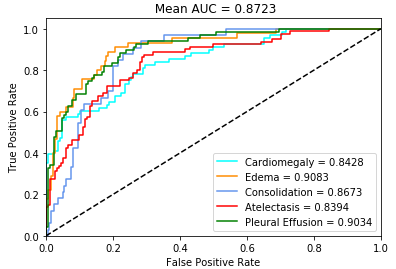

# CheXpert 
Classification of X-ray images.

# About the Challenge

**[CheXpert](https://stanfordmlgroup.github.io/competitions/chexpert/)**
is a large dataset of chest X-rays and competition for automated chest x-ray interpretation, which features uncertainty labels and radiologist-labeled reference standard evaluation sets.

# Dataset
Data can be otained from the [Challenge Website](https://stanfordmlgroup.github.io/competitions/chexpert/)

# Implementation
In this project the [CheXpert: A Large Chest Radiograph Dataset with Uncertainty Labels and Expert Comparison
](https://arxiv.org/abs/1901.07031) is reimplemented.

1. Data Science Pipeline: Build a ML Model with adjustable sensitivity
    
    1.1. implement preprocessing
    
    1.2. apply different Deeplearning architectures e.g. ResNet and Densenet
    
    1.3. Plot the results in AUC as curves

2. Gitlab CI Pipeline that builds the project, installs its dependenccies and runs unit-tests for reading data in and sanity check of results

3. Classification results improved through data augmentation 

4. Show a working Codalab workflow 

# Training
- Model: Densenet121 Pretrained Model (Imagenet) 
- 3 Epochen
- Adam Optimizer
- Dealing with Uncertainty:
    - U-Ignore
    - U-Zeros
    - U-Ones

# Results:
**U-Ignore:**

**U-Zeroes:**

**U-Ones:**

# Citation

Irvin, J., Rajpurkar, P., Ko, M., Yu, Y., Chute, C., Marklund, H., Haghgoo, B., Ball, R., Shpanskaya, K., Seekins, J., Mong, D. A., Halabi, S. S., Sandberg, J. K., Jones, R., Larson, D. B., Langlotz, C. P., Patel, B. N., Lungren, M. P., & Ng, A. Y. (2019). CheXpert: A Large Chest Radiograph Dataset with Uncertainty Labels and Expert Comparison. arXiv. https://doi.org/10.48550/arXiv.1901.07031
